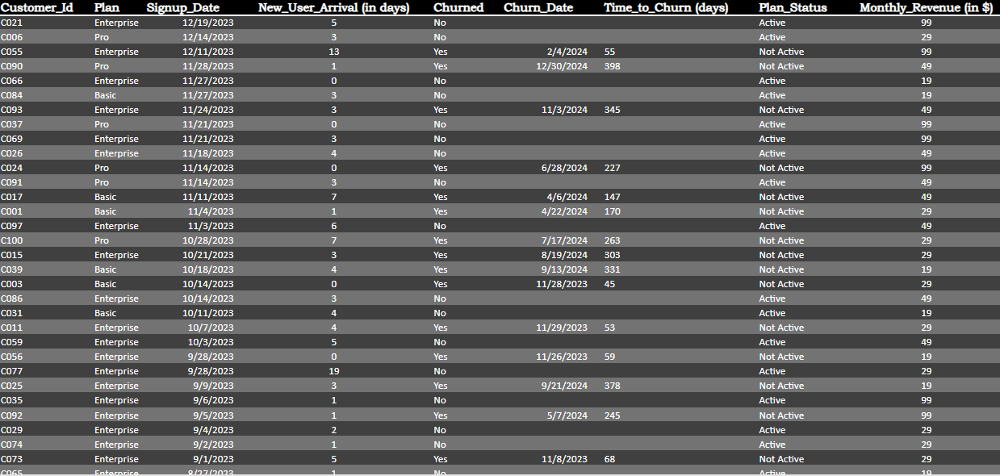
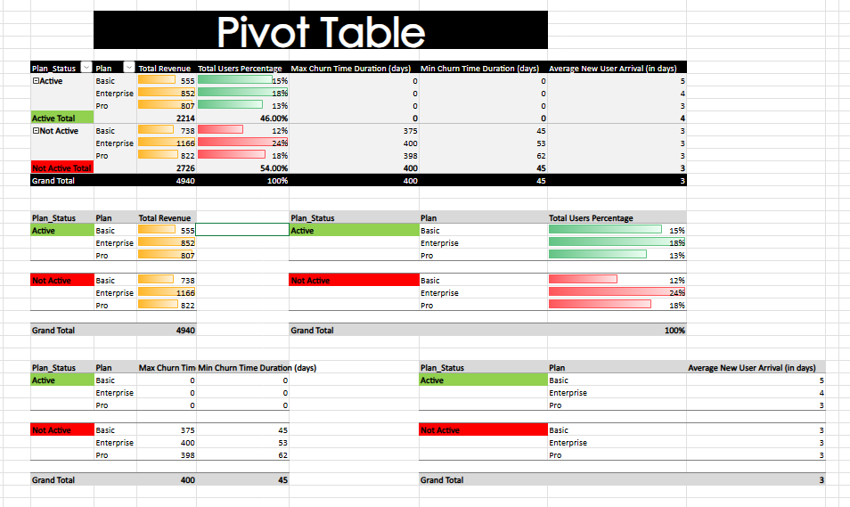
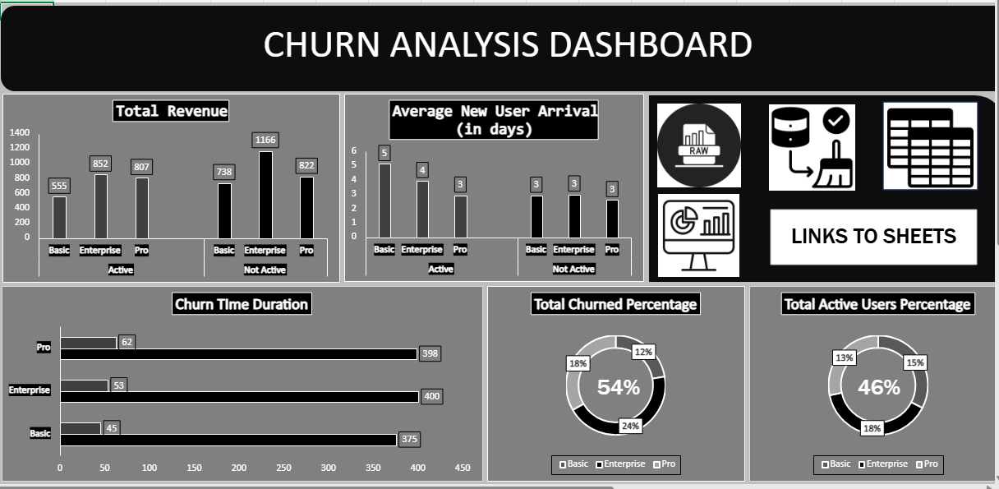

# saas-customer-churn-analysis-excel
Excel-based analysis of SaaS customer churn, focusing on revenue impact, retention patterns, and business insights.

---

# 📊 SaaS Customer Churn Analysis (Excel)
## 🔍 Problem Statement

Customer churn is a critical challenge for SaaS companies as it directly impacts revenue and long-term growth.
This project aims to analyze customer churn patterns across different subscription plans to understand revenue impact, churn timing, and user retention behavior.

## 📁 Dataset Overview

The dataset contains customer-level SaaS subscription data, including:

Customer ID

Subscription Plan (Basic, Pro, Enterprise)

Signup Date

Churn Status & Churn Date

Monthly Revenue

Additional derived fields were created during analysis.

## 🧹 Data Cleaning & Preparation

The following steps were performed using Excel:

Removed duplicates and ensured consistent formatting

Standardized date fields

Handled missing values (e.g., churn dates for active users)

Created clean, analysis-ready tables

## 🧮 Feature Engineering

To enable deeper analysis, the following metrics were created:

New User Arrival (days): Time gap between consecutive signups

Time to Churn (days): Duration between signup and churn date

Plan Status: Active vs Not Active (churned)

## 📊 Analysis Performed

Using Pivot Tables and Excel formulas, the following analyses were conducted:

Revenue distribution by plan and churn status

Active vs churned user percentages

Average new user arrival by plan

Minimum and maximum churn duration by plan

 

## 📈 Dashboard

An interactive Churn Analysis Dashboard was created in Excel to visualize:

Total revenue by plan and churn status

Churned vs active user percentages

Average new user arrival time

Churn duration patterns

## 🔑 Key Insights

Enterprise plans generate the highest revenue across both active and churned users

More than 50% of users have churned, indicating a retention challenge

User acquisition is steady across plans, suggesting pricing is not a major barrier

Churn typically occurs after 2–12 months, indicating dissatisfaction develops over time rather than during onboarding

## 📌 Business Conclusion

The analysis suggests that while the product successfully attracts users, long-term retention remains a concern. Pricing does not appear to be the primary driver of churn. Instead, the churn pattern points toward potential gaps in sustained value delivery, customer experience, or engagement over time.

## 🚀 Next Steps

Analyze churn by tenure buckets (0–3, 3–6, 6–12 months)

Incorporate qualitative data such as customer feedback or usage behavior

Focus retention strategies on high-revenue Enterprise users

## 🛠 Tools Used

Microsoft Excel (Data Cleaning, Analysis, Dashboarding)

## 📂 Excel Analysis
Explore the full Excel workbook (data cleaning, calculations, pivot tables, and dashboard) here:  
excel/README.md

